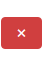
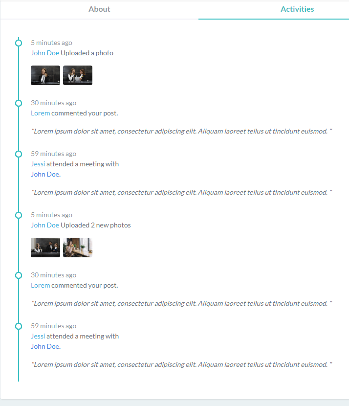

## Dashboards

# ``src/pages/Dashboards``

`PageBreadcrumb` > Dashboards Cards
`statistics` > The Cards data

`WeeklySelesChart` > Weekly Sales Report

`YearlySelesChart` > Yearly Sales Report

`ChatList` > The Chat

`Projects` > Projects

## Starter Page
# ``src/pages/Starter.tsx``
`Starter` > Starter Page

## Contact List
# ``src/pages/other/ContantList.tsx``

`className="input-group"` 

`className="input-group-append"`

`className="me-3"` > User Avatar

`className="info"` > User Name & description

`className="ri-pencil-fill"` > Edit button

`className="ri-close-fill"` > Delete button

`className="social-list list-inline mt-3 mb-0"` > Communication accounts

`className="col-sm-12"` > Change page

# Profile
## ``src/pages/other/Profile``

`className="profile-bg-picture"` >  big pic / background

`className="profile-user-img"` > User Img

`className="mt-4 fs-17 ellipsis"` > User text 1
`className="font-13"` > User text 2
`className="text-muted mb-0"` > User text 3

`className="ri-settings-2-line align-text-bottom me-1 fs-16 lh-1"` > Edit Profile
`className="ri-check-double-fill fs-18 me-1 lh-1"` > Following

`className="nav-underline gap-0"` > About & Activities & Settings & Projects . button

`eventKey="About"` > Content About

`eventKey="Activities"` > Content Activities

`eventKey="Settings"` > Content Settings

`eventKey="Projects"` > Content Projects

## Timeline
# ``src/pages/other/Timeline.tsx``

`className="btn btn-primary w-lg"` > Todey Text

`className="arrow-alt"` > arrow silver

`className="arrow"` > arrow blue

`className="album"` `{item.time}` > pic under the text

`{item.text}` > the text

`className="timeline-date text-muted"` > time

`{item.date}` > Item Title

`{item.variant}` > Coulor

## Invoice
# ``src/pages/other/Invoice.tsx``

`className="float-start mb-3"` > img
 

`className="m-0 d-print-none"` > Invoice text

`className="float-end mt-3"` > name

`className="text-muted fs-13"` > text under name

`className="col-sm-4 offset-sm-2"` > order info

`className="row mt-4"` > Billing & Shipping Address

`className="border-top border-bottom bg-light-subtle border-light"` > order id & item & quantity & Cost & Toal cost

`className="text-muted fs-14"` > note

`className="col-sm-6"` > Sub-total & VAT & Toal Cost

`className="d-print-none mt-4"` > Print & Submit

## FAQ
# ``src/pages/other/FAQ.tsx``

`className="justify-content-center"` > FAQ title & text & buttons

`className="faq-question"` > text Title

`className="faq-answer mb-4"` > text under Title

`className="faq-question-q-box"` > Icon

## Pricing
# ``src/pages/other/Pricing.tsx``

`className="text-center"`  `className="text-muted mb-5"` > Title & Text

`className="justify-content-center my-3"` > Cards Info & Button

`` >
`` >
`` >
`` >
`` >
`` >
`` >
`` >
`` >
`` >
`` >
`` >
`` >
`` >
`` >
`` >
`` >
`` >
`` >
`` >
`` >
`` >
`` >
`` >
`` >
`` >
`` >
`` >
`` >
`` >
`` >
`` >
`` >
`` >
`` >
`` >
`` >
`` >
`` >

`` >